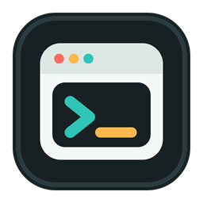
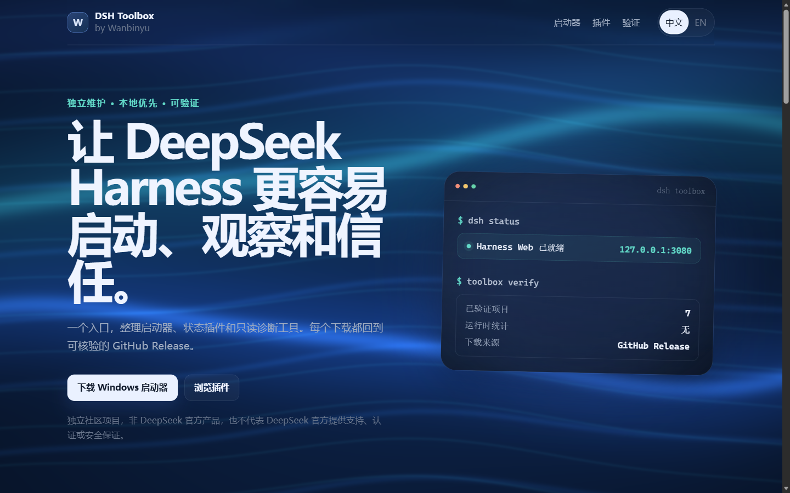

# dsh-launcher

[简体中文](README.md) | [English](README.en.md)

> [!IMPORTANT]
> **Android 版是实验性客户端，必须有电脑，APK 不能独立运行 DeepSeek Harness。** DeepSeek Harness 官方目前没有提供 Android 本机安装与运行方式；当前 `0.1.1-rc.2` 在普通局域网 HTTP 下还存在 UUID、Host/Origin 校验和远程设置限制，即使页面打开也不能保证完整功能。本应用不会绕过官方安全边界。请先阅读 [Android v0.1.2 下载页](https://github.com/Wanbinyu/dsh-launcher/releases/tag/android-v0.1.2)，不要从第三方来源下载。

<p align="center"></p>

[](https://github.com/Wanbinyu/dsh-launcher/actions/workflows/ci.yml)
[](LICENSE)

面向 [DeepSeek Harness](https://github.com/deepseek-ai/deepseek-harness) 的 Windows 快捷启动器。输入 `dsh` 或 `deepseek`，后台启动 Harness，服务就绪后自动打开网页；进程、日志和状态由系统托盘管理。Windows 是主版本，仓库同时提供配套的 [Android 平板客户端](android/README.md)。

> [!NOTE]
> 这是独立的社区便利工具，不修改 DeepSeek Harness 源码，也不是 DeepSeek 官方工具。它是 Windows 启动器，不是 Cordis 插件，不提供 `dsh.bundle`。

## 在线项目界面

访问 **[Wanbinyu DSH Toolbox](https://wanbinyu.github.io/wanbinyu-harness-toolbox/)**，可以在一个页面中查看 Windows 启动器、配套插件、固定版本下载和项目验证信息。下载按钮直接指向对应的 GitHub Release；页面无广告、无遥测，也不会在浏览时读取本机 Harness 数据。

<p align="center">
  <a href="https://wanbinyu.github.io/wanbinyu-harness-toolbox/">
    
  </a>
</p>

<p align="center"><sub>点击截图打开 DSH Toolbox。该页面及本启动器均为独立社区项目，并非 DeepSeek 官方产品。</sub></p>

## 平台版本

| 平台 | 版本 | 定位 |
| --- | --- | --- |
| Windows | `0.5.1` | 主版本；可安装、启动并管理 Harness，提供本地插件与 Skills 推荐向导。 |
| Android | `0.1.2` | 实验性局域网客户端；连接 Windows 主机，不保证完整远程 Web 功能。 |

Android 版要求 Android 10 或更高版本，只能在可信私有网络中测试。Harness 的 LAN 模式目前没有身份认证，且普通 HTTP 远程访问存在已知限制，详见 [Android 安装与安全说明](android/README.md)。

## 功能

- 无控制台后台启动，不占用当前终端。
- 双击后立即显示启动进度窗；服务就绪并打开网页后自动关闭，冷启动期间不再没有反馈。
- 首次运行自动检查 Node.js、npm 和 Harness；缺失时提供中英文安装向导。
- 可经用户确认，通过 Windows Package Manager 安装 Node.js LTS，再从 npm 安装官方 `@deepseek-ai/dsh` 包。
- Harness 安装到当前用户独立目录，已有源码、全局包和 Web profile 始终优先，不会被覆盖。
- 安装过程显示实时阶段、npm 输出和取消按钮；失败信息同时写入本地日志。
- 系统托盘菜单：启动、打开网页、查看状态、重启、停止、Harness 安装/更新/修复/卸载、打开日志、赞赏作者和退出。
- 托盘“小功能”提供跨作者的插件与 Skills 推荐：覆盖普通办公、表格统计、管理汇报、政务行政、软件开发、AI 成本、研究整理、视觉设计和自动化，也可手动浏览完整目录。
- 每项都用中英文显示用途、推荐原因、发布者、许可证、环境要求、隐私与联网边界；普通场景默认只勾选 3–6 项，完整目录默认不勾选，避免一次安装过多。项目名和安装命令是固定标识，不做翻译。
- 支持按名称、用途、作者和中英文关键词搜索，并按插件/Skill、开源/专有许可筛选；也可以隐藏已经安装的插件。
- 打开向导后通过官方 `dsh plugin --profile web list --depth 0 --json` 只读识别 Web Profile 中的插件和版本；同版本项目自动取消勾选。工作区 Skills 不猜测路径，继续由 Harness 在安装前核验。
- “检查目录健康”仅在用户点击后联网，核对固定 Skill 路径、插件 `dsh.bundle.patch` 指向的清单文件以及 npm/Release 安装源，并显示本次检查时间。网络失败只标记为无法核验，不会自动删除项目。
- 点击“复制安装请求并打开 Harness”会生成一段可审查的中文请求，包含固定来源与命令，然后打开 Harness；用户粘贴并发送后由 Harness 核验和安装，启动器本身不执行命令。
- 新安装或启动器版本更新后只询问一次使用方向；同一版本不重复打扰，之后可随时从托盘重新选择。
- 托盘支持手动检查启动器更新，并可勾选自动检查；自动检查默认开启、每天最多访问一次 GitHub，发现新版后只提示，不静默下载安装。
- 可选的本地赞赏窗口；完全自愿、不影响任何功能，不联网也不记录赞赏状态。
- 提供 `dsh`、`deepseek` 两个命令入口，双击桌面快捷方式也可以启动。
- 自动检测 `127.0.0.1:3080`，服务就绪后打开默认浏览器。
- 自动识别 Harness 版本；对 `rc.8` 及更高版本使用 `--no-open`，避免官方 CLI 与启动器重复打开网页。
- 合并桌面、托盘和命令行发出的重复启动请求，只在同一次启动真正就绪后打开一次浏览器。
- EXE、托盘、桌面快捷方式和安装器使用统一的多尺寸 Windows 图标。
- 隐藏运行 Harness 子进程，退出托盘时清理整个子进程树。
- Harness 标准输出和错误输出写入本地日志，便于排查启动失败。
- Doctor 诊断 Harness CLI、Node.js、包管理器、Web profile、bundle 清单、重复核心运行时、端口和日志目录。
- 可复制或保存已脱敏的诊断报告，便于在 Issue 中安全分享。
- 保留 PowerShell 和 `.cmd` 入口；没有安装 EXE 时仍能使用旧版 CLI 回退逻辑。

## 安装

推荐从 GitHub Releases 下载 `dsh-launcher-setup.exe`，运行安装器后重新打开终端。安装器会安装自包含的 EXE、创建开始菜单和可选桌面快捷方式、把安装目录加入当前用户 PATH、注册卸载入口，并在完成页提供“启动并检查 Harness”选项。

启动器安装包本身不捆绑 Node.js 或 DeepSeek Harness。首次双击时会先复用已有 Harness；如果没有，会显示安装向导：

1. 检测 Node.js `22.19.0+`、npm、`winget` 和现有 Harness；旧版 Node.js 会被视为需要升级。
2. 缺少 Node.js 时，在用户确认后通过 `winget` 安装 Node.js LTS；没有 `winget` 时打开 Node.js 官网。
3. 从当前 npm registry 查询固定的最新 `@deepseek-ai/dsh` 版本，并通过受管 pnpm 安装到 `%LOCALAPPDATA%\dsh-launcher\managed-harness`；构建脚本只允许当前官方 Harness 所需的明确依赖白名单。
4. 校验包名、版本和 CLI 入口后，继续创建 Web profile、启动服务并打开网页。

这条安装路径不需要访问 GitHub，但需要能够访问 npm registry。安装器不会静默提升权限，`winget` 或 Node.js 安装程序可能显示 Windows 权限确认。选择“仅本次运行”仍可保留原来的 `npx` 临时启动方式。

从源码构建安装包：

```powershell
$env:DSH_DOTNET = 'C:\path\to\dotnet.exe' # dotnet 已在 PATH 中时可以省略
powershell -ExecutionPolicy Bypass -File .\installer\build.ps1
```

只构建便携版 EXE：

```powershell
powershell -ExecutionPolicy Bypass -File .\installer\build.ps1 -SkipInstaller
```

完整安装包需要 [Inno Setup 6](https://jrsoftware.org/isinfo.php)：

```powershell
winget install --id JRSoftware.InnoSetup --exact
```

开发者仍可以使用旧的 PATH 安装方式：

```powershell
powershell -ExecutionPolicy Bypass -File .\install.ps1
```

这个方式只把仓库目录加入 PATH；如果目录旁边没有 `dsh-launcher.exe`，会回退到 PowerShell 实现。

## 使用

安装后重新打开 PowerShell 或命令提示符：

```powershell
dsh
# 或
deepseek
```

常用管理命令：

```powershell
dsh start       # 启动后台托盘实例和 Harness
dsh stop        # 停止 Harness，保留托盘实例
dsh restart     # 重启 Harness 并打开网页
dsh status      # 弹窗显示状态和 PID
dsh open        # 打开当前配置的网页地址
dsh logs        # 打开日志目录
dsh exit        # 停止 Harness 并退出托盘
dsh doctor      # 显示完整诊断报告
```

诊断报告支持机器可读、剪贴板和文件输出：

```powershell
dsh doctor --json
dsh doctor --copy
dsh doctor --report .\dsh-doctor.txt
dsh doctor --json --report .\dsh-doctor.json
```

报告会移除 URL 凭据、查询参数、片段，以及常见的 Token、密码和 API Key 值。分享前仍建议快速检查一次报告内容。Doctor 发现阻塞问题时返回退出码 `1`，否则返回 `0`，便于脚本和 CI 使用。托盘菜单也提供“复制诊断报告”。

双击桌面或开始菜单中的 `dsh-launcher` 快捷方式，效果等同于 `dsh`。点击托盘图标的“退出”会同时停止 Harness 和托盘进程。

启动期间进度窗和托盘图标会立即出现，服务就绪并打开网页后进度窗自动关闭；启动时间较长时会提示首次启动或更新可能需要多等几秒。此时再次双击托盘会等待同一个启动任务，不会弹出多个进度窗、提前打开不可访问的 `127.0.0.1` 页面或重复启动 Harness。

托盘中的“Harness 安装与管理”可以重新安装、更新或修复启动器受管副本，也可以只删除受管目录。删除操作不会触碰全局 Harness、`%USERPROFILE%\.dsh` Web profile、插件、会话或工作区。受管目录可通过 `DSH_LAUNCHER_MANAGED_ROOT` 改写，适合测试或自定义部署。

托盘“小功能 → 插件与 Skills 推荐”使用随安装器内置的本地规则，不调用大模型，也不读取 Harness 会话、工作区、提示词、回复、路径或密钥。选择的使用方向和当前版本的已提示标记仅保存在 `%LOCALAPPDATA%\dsh-launcher\recommendations.json`。

目录同时收录多个作者的项目，但“已核验来源”不等于 DeepSeek 官方背书。插件需要具备 DSH bundle 清单和可复现的 npm 或 Release 地址；Skills 固定到明确的 GitHub 提交，并显示各自许可证。`xlsx`、`docx`、`pdf`、`pptx` 使用 Anthropic 的专有 source-available 条款，不应被理解为开源项目；`doc-coauthoring` 没有独立许可证文件，安装前必须再次核对仓库条款。Skills 命令默认设置 `DO_NOT_TRACK=1`，并以 `-a universal --copy` 安装到当前工作区的 `.agents/skills`。

向导不会静默安装，也不会自动操作 Harness 网页。点击复制按钮后，启动器只把“请帮我安装下面的插件和 Skills”以及来源、许可、要求和命令放进剪贴板，再打开 Harness。用户需要在输入框按 `Ctrl+V`、检查后发送；请求会要求 Harness 重新核对版本和许可证、逐项汇报结果、失败时不放宽 `allowBuilds`，并在完成后提醒用户从托盘重启。这样既保留 Harness 的权限审批，也减少启动器自行维护安装逻辑的风险。

安装状态检查不会读取会话或工作区文件，只执行官方插件列表命令并解析包名和版本。由于 `.agents/skills` 属于当前 Harness 工作区，启动器不会猜测或扫描可能的工作区路径；生成的请求会要求 Harness 先检查目标 Skill 是否已存在。目录健康检查默认不运行，只有点击按钮才会访问条目公开的 GitHub、raw GitHub、npm 或 Release 地址，不上传选择、不记录遥测，也不把临时网络失败当作项目已经失效。

DeepSeek Harness `rc.8` 开始会自行打开 Web 页面。启动器读取本地包版本，并在后台托管 `rc.8+` 时传入 `--no-open`，继续由托盘统一等待服务就绪后只打开一次；`rc.7` 保持原有启动参数。

如果目标网页地址在启动前已经有服务响应，启动器不会再拉起第二个 Harness 进程，而是复用现有服务并打开网页；这也可以避免端口被其他服务占用时重复启动。

显式参数仍会交给官方 CLI：

```powershell
dsh --help
dsh web --help
dsh --profile tui --resume my-session
dsh plugin --profile tui add <package>
```

调试启动器或需要看到 Harness 前台输出时使用：

```powershell
dsh --foreground
```

无参数启动的官方等价命令是：

```text
npx @deepseek-ai/dsh web
```

## CLI 选择顺序

启动器按以下顺序寻找 Harness CLI：

1. `DEEPSEEK_HARNESS_DIR`：在 Harness 源码目录执行 `pnpm dsh`。
2. `DEEPSEEK_DSH_BIN`：使用指定的 `dsh.cmd`、可执行文件或 JavaScript 入口。
3. 当前目录及上级目录中的本地 `@deepseek-ai/dsh`。
4. 全局安装的 `@deepseek-ai/dsh`。
5. PATH 中其他位置的 `dsh` 命令。
6. `npx --yes @deepseek-ai/dsh`。

源码目录模式：

```powershell
[Environment]::SetEnvironmentVariable(
  'DEEPSEEK_HARNESS_DIR',
  'C:\path\to\deepseek-harness',
  'User'
)
```

源码目录需要已经可以执行 `pnpm dsh`。修改用户环境变量后请重新打开终端。

## 配置

| 变量 | 作用 |
| --- | --- |
| `DSH_WEB_URL` | 完整的 HTTP(S) 检测和打开地址，例如 `http://127.0.0.1:3081/`。 |
| `DSH_WEB_PORT` | 未设置 `DSH_WEB_URL` 时使用的端口，默认 `3080`。 |
| `DSH_AUTO_OPEN` | 设置为 `0`、`false`、`no` 或 `off`，禁止服务就绪后自动打开浏览器。 |
| `DSH_START_TIMEOUT_SECONDS` | 等待网页就绪的秒数，默认 `30`，范围 `1-300`。 |
| `DSH_LOG_DIR` | 自定义日志目录。默认 `%LOCALAPPDATA%\dsh-launcher\logs`。 |
| `DEEPSEEK_HARNESS_DIR` | 指定 Harness 源码目录。 |
| `DEEPSEEK_DSH_BIN` | 指定 CLI 文件或 JavaScript 入口。 |

启动器只检测并打开本机地址，不会修改 Harness 的监听地址，也不会把服务暴露到网络。

## 故障排查

| 现象 | 处理方式 |
| --- | --- |
| `dsh` 不是命令 | 重新打开终端，确认安装器已把安装目录加入用户 PATH。 |
| 怀疑 CLI、profile、插件清单、重复运行时、端口或日志目录有问题 | 执行 `dsh doctor` 查看诊断结果；提交 Issue 时可附上 `dsh doctor --copy` 的脱敏报告。 |
| 首次配置下载 Node.js 或 Harness 很久后没有打开 | 从托盘菜单打开“打开日志目录 / Open logs”或执行 `dsh logs`，检查 `winget`、npm 网络、权限确认或安全软件拦截。 |
| 浏览器没有自动打开 | 执行 `dsh status`，检查端口；必要时设置 `DSH_WEB_URL`。 |
| Harness 启动失败 | 执行 `dsh logs` 查看最新日志，确认 Node.js/npm 或 pnpm 可用。 |
| 运行了错误的 CLI | 设置 `DEEPSEEK_HARNESS_DIR` 或 `DEEPSEEK_DSH_BIN`，并重新打开终端。 |
| 想恢复前台输出 | 执行 `dsh --foreground`。 |

## 开发验证

```powershell
powershell -ExecutionPolicy Bypass -File .\assets\build-icon.ps1

powershell -ExecutionPolicy Bypass -File .\tests\smoke.ps1

# 仅编译 .NET 项目
& $env:DSH_DOTNET build .\src\DshLauncher\DshLauncher.csproj -c Release

# 生成便携版和 SHA256 校验文件
powershell -ExecutionPolicy Bypass -File .\installer\build.ps1 -SkipInstaller

# 核对版本、文件和 SHA256 内容
powershell -ExecutionPolicy Bypass -File .\tests\verify-release-assets.ps1 -SkipInstaller
```

图标脚本从项目内 SVG 源文件生成 README 预览图和包含 9 种尺寸的 ICO。测试覆盖默认补 `web`、显式参数透传、可配置 CLI 路径、启动请求合并、推荐偏好、内置插件清单、推荐窗口和图标资源嵌入。Doctor 可用 `dsh doctor --json` 做无弹窗验证。GitHub Actions 会实际生成 Windows 便携版与安装器并核对版本和 SHA256，同时执行 Android Debug/Release 测试、lint、R8 和打包。托盘运行仍需在 Windows 桌面会话中验证。

## 项目边界

本仓库只负责 Windows 命令入口、后台生命周期和托盘控制。Harness CLI、profile、插件、配置和 Web 应用仍由官方项目维护。

## 链接

- [DeepSeek Harness](https://github.com/deepseek-ai/deepseek-harness)
- [GitHub 仓库](https://github.com/Wanbinyu/dsh-launcher)
- [Issues](https://github.com/Wanbinyu/dsh-launcher/issues)
- [English README](README.en.md)

## 许可证

MIT，详见 [`LICENSE`](LICENSE)。
