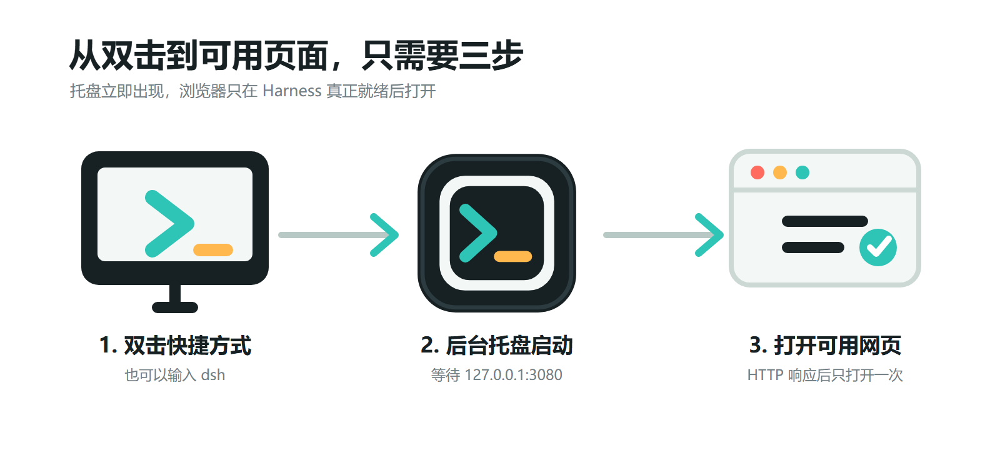

# 让 DeepSeek Harness 一键启动：我做了一个 Windows 托盘启动器 dsh-launcher


DeepSeek Harness 本身已经提供了 Web 界面，但在 Windows 上日常使用时，我希望启动过程再简单一点：不用每次打开终端、输入较长的命令，也不用盯着终端判断服务什么时候可以访问。

所以我做了 **dsh-launcher**。它是一个独立的开源 Windows 启动器：双击桌面快捷方式，托盘图标立即出现；Harness 在后台启动；等本地 Web 服务真正可用后，再自动打开浏览器。

项目地址：<https://github.com/Wanbinyu/dsh-launcher>

安装包：<https://github.com/Wanbinyu/dsh-launcher/releases/latest>

> dsh-launcher 是独立的社区便捷工具，不是 DeepSeek 官方项目，也不是 Cordis 插件。Harness CLI、配置、插件和 Web 应用仍由官方项目负责。

## 为什么做这个启动器

官方方式可以直接运行：

```powershell
npx @deepseek-ai/dsh web
```

这个方式适合开发和排查问题，但如果每天都要打开 Harness，我更希望它像普通 Windows 软件一样工作：

- 双击就能启动；
- 不保留一个终端窗口；
- 有托盘状态和生命周期控制；
- 服务没准备好时不打开失败页面；
- 重复双击不会启动多个 Harness；
- 出问题时有日志和诊断报告。

dsh-launcher 的目标就是把这些高频操作包成一个安静、稳定的桌面入口。

## 从双击到可用页面



启动器会先创建托盘，再解析本机可用的 Harness CLI，并在后台执行 Web 模式。随后它持续检测配置的地址，默认是 `http://127.0.0.1:3080/`。

只有收到 HTTP 响应后，启动器才会调用默认浏览器。桌面快捷方式、托盘双击和命令行发出的并发请求会合并为同一个启动任务，因此最终只有一个托盘进程、一个 Harness 子进程和一次浏览器打开动作。

## 实际运行界面


打开后仍然是完整的 DeepSeek Harness Web 界面。dsh-launcher 不修改 Harness 页面，也不接管 profile、模型或插件配置，只负责 Windows 侧的启动、等待、托盘和日志。

托盘菜单目前提供：

- 启动和打开网页；
- 查看运行状态和 PID；
- 重启或停止 Harness；
- 打开日志目录；
- 复制脱敏后的诊断报告；
- 退出托盘并清理 Harness 子进程树。

## 安装和使用

在 Releases 页面下载 `dsh-launcher-setup.exe`。安装向导可以创建桌面快捷方式，同时会把安装目录加入当前用户的 PATH。

安装后可以直接双击，也可以在新的 PowerShell 或命令提示符中输入：

```powershell
dsh
# 或
deepseek
```

常用命令包括：

```powershell
dsh status
dsh restart
dsh stop
dsh logs
dsh doctor
dsh exit
```

显式传入的其他参数会继续交给官方 Harness CLI，例如：

```powershell
dsh --profile tui --resume my-session
dsh plugin --profile tui add <package>
```

## 不只是一个快捷方式

启动器会按顺序查找源码目录、显式配置的 CLI、本地或全局安装包、PATH 中的官方命令，最后才回退到 `npx`。这意味着已经安装过 Harness 的机器可以更快启动，也可以减少重复下载。

项目还提供 `dsh doctor`，用于检查 Node.js、包管理器、Harness CLI、Web profile、bundle 清单、重复核心运行时、端口和日志目录。诊断报告会移除 URL 凭据、查询参数以及常见的 token、密码和 API Key 字段，方便在 Issue 中提供必要信息。

## 新的独立图标

这次也为项目补了一套独立图标：应用窗口代表 Harness Web 界面，青绿色箭头代表启动命令，琥珀色横线代表就绪状态。

ICO 包含从 16 到 256 像素的 9 种尺寸，其中托盘使用的小尺寸帧做了单独简化。EXE、托盘、桌面快捷方式、开始菜单和安装器现在使用同一套视觉标识，同时避免使用 DeepSeek 官方 Logo 造成误认。

## 项目链接

- GitHub：<https://github.com/Wanbinyu/dsh-launcher>
- 最新版本：<https://github.com/Wanbinyu/dsh-launcher/releases/latest>
- DeepSeek Harness：<https://github.com/deepseek-ai/deepseek-harness>

项目采用 MIT License。当前主要面向 Windows，如果你在使用中遇到启动、CLI 解析或托盘交互问题，可以直接在 GitHub Issues 中反馈。
