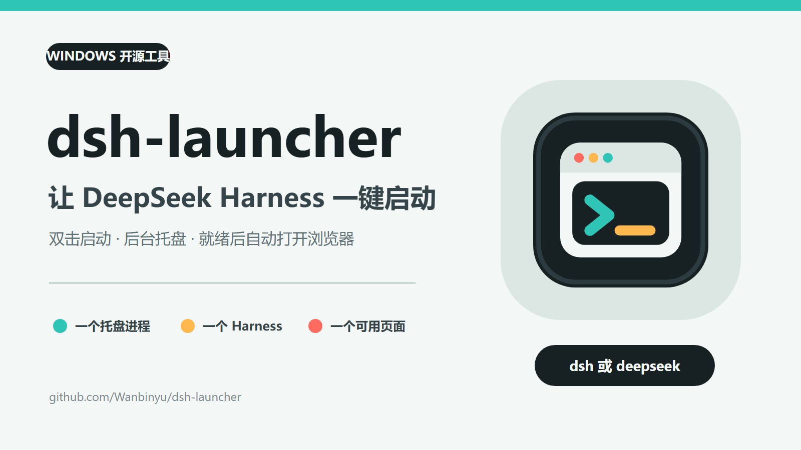
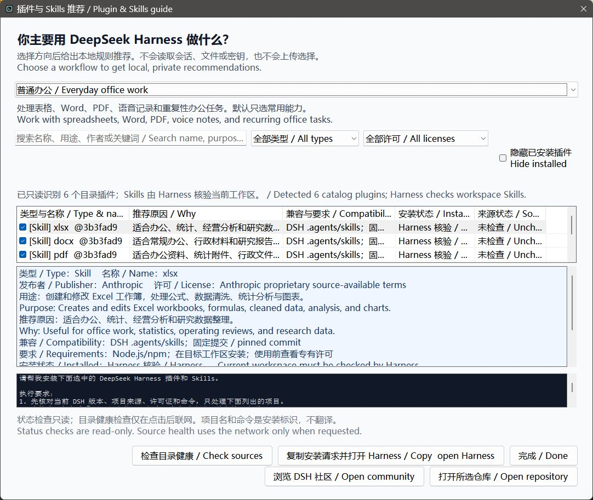

# DeepSeek Harness 启动器 v0.5.0：首批加入 19 个插件与 Skills 推荐

平时使用 DeepSeek Harness 时，找到合适的插件或 Skill 往往比安装本身更费时间：项目分散在不同仓库，适合程序员的工具不一定适合办公用户，安装之前还要确认来源、许可证、环境要求和是否已经安装。

这次我为 Windows 启动器 **dsh-launcher** 发布了 `v0.5.0`，在原有的一键启动、托盘管理、自动检查更新和 Harness 安装修复基础上，新增了“插件与 Skills 推荐”。

项目地址：<https://github.com/Wanbinyu/dsh-launcher>

v0.5.0 下载：<https://github.com/Wanbinyu/dsh-launcher/releases/tag/v0.5.0>

> dsh-launcher 是独立的开源社区工具，并非 DeepSeek 官方项目。推荐目录也不代表 DeepSeek 官方认可或背书，安装前仍应查看对应项目的说明和许可证。

## 先从 19 个项目开始

`v0.5.0` 首批收录了 **19 个经过来源核验的项目**：

- 11 个 DeepSeek Harness 插件；
- 8 个 Skills；
- 来自多个不同作者和项目；
- 覆盖 10 类工作场景。

目前的 19 个不是目录上限，也不是为了追求数量而做的大合集。我希望先用一批来源明确、用途清楚的项目验证实际效果，再根据用户反馈、兼容性和真实使用价值继续增加。

后续会优先补充普通办公、表格统计、管理汇报、政务行政、软件开发、研究整理、视觉设计、AI 成本控制和自动化等方向，而不是只推荐我自己开发的项目。

## 按工作方向推荐，而不是先要求用户懂插件

推荐窗口首先询问“你主要用 DeepSeek Harness 做什么”。用户可以选择日常办公、表格与数据、开发、研究等方向，也可以直接浏览完整目录。

普通场景默认只选择 3～6 个更相关的项目，完整目录则默认不全选，避免第一次使用时一次安装过多内容。每个条目会同时展示：

- 中文和英文用途说明；
- 推荐原因和适用场景；
- 作者、版本和许可证；
- 环境与兼容性要求；
- 隐私边界和是否需要联网；
- 当前安装状态和来源检查结果。

窗口支持中英文关键词搜索，也可以按插件或 Skill、开源或其他许可类型筛选。

这不是把用户的工作内容发送给大模型后再生成推荐。推荐规则和目录都内置在本地，不读取 Harness 会话、提示词、回复、API Key、工作区路径或文件内容，也没有增加遥测。

## 避免重复安装，并检查项目来源

启动器会通过 Harness 官方命令只读获取 Web Profile 中的插件列表和版本。已经安装同版本的插件会自动取消勾选，用户也可以隐藏所有已安装插件。

Skills 是否存在于当前工作区，仍然交给 Harness 在执行安装请求前核验，启动器不会扫描或猜测用户的工作区。

“检查目录健康”是一个需要用户主动点击的联网功能。它会检查固定的 Skill 路径、插件包声明、实际 bundle patch 文件以及 npm 或 GitHub Release 安装来源。如果只是临时网络失败，项目只会显示为“无法核验”，不会擅自从目录中删除。

## 启动器不直接绕过权限安装

我没有让启动器在后台直接执行所有安装命令。

选好项目后，点击“复制安装请求并打开 Harness”，启动器会生成一段可以检查的自然语言请求，其中包含项目来源、许可证、环境要求和固定安装命令，然后打开 Harness。

用户只需要在 Harness 输入框中按 `Ctrl+V`，确认内容后再发送。这样既减少了手工整理命令的麻烦，也保留了 Harness 原有的权限提示和审批流程。

生成的请求还会要求 Harness：

- 先核对当前版本和项目来源；
- 跳过已经安装的相同版本；
- 插件安装到 Web Profile；
- Skills 安装到当前工作区的 `.agents/skills`；
- 遇到失败时逐项说明，不擅自放宽构建权限。

## 如何使用

1. 从 Releases 下载 `dsh-launcher-setup.exe` 并完成安装。
2. 双击桌面快捷方式，等待 DeepSeek Harness 自动打开。
3. 右键托盘图标，进入“小功能 → 插件与 Skills 推荐”。
4. 选择工作方向，查看或搜索推荐项目。
5. 按需执行来源健康检查并调整勾选项。
6. 点击“复制安装请求并打开 Harness”，在输入框粘贴、检查并发送。

如果只是想启动 Harness，原来的使用方式没有变化：双击快捷方式即可；也可以在终端输入 `dsh` 或 `deepseek`。

## 接下来还会继续扩充

这次先收录 19 个插件与 Skills，是为了把目录筛选、场景推荐、安装状态识别、来源检查和安装交接这一整套流程先做稳定。

如果实际使用效果不错，后续版本会继续增加新的场景和项目，同时持续复查已有条目的来源、版本和兼容性。也欢迎开发者或使用者在 GitHub Issues 中推荐项目；收录时会优先考虑用途是否明确、来源是否可核验、安装方式是否稳定、许可证是否清楚，以及是否确实适用于 DeepSeek Harness。

## 项目链接

- GitHub：<https://github.com/Wanbinyu/dsh-launcher>
- v0.5.0：<https://github.com/Wanbinyu/dsh-launcher/releases/tag/v0.5.0>
- DeepSeek Harness：<https://github.com/deepseek-ai/deepseek-harness>

dsh-launcher 使用 MIT License，目前 Windows 是主版本。欢迎试用后反馈哪些推荐真正有帮助，以及下一批最希望加入哪类插件或 Skills。

建议标签：`DeepSeek`、`DeepSeek Harness`、`AI 工具`、`开源项目`、`Windows`、`插件`、`Skills`
